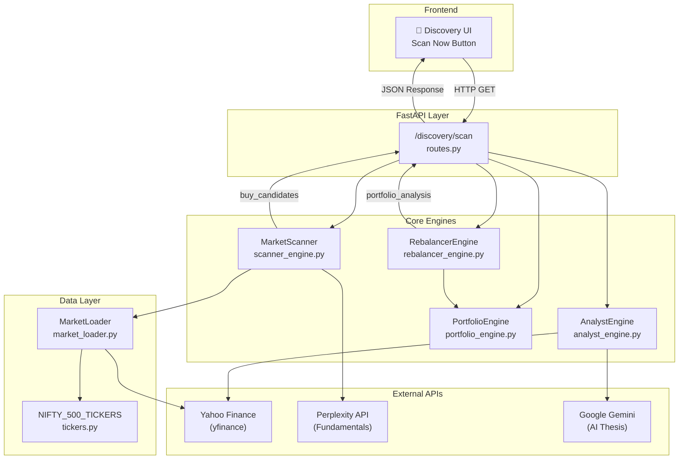
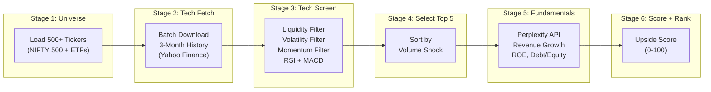
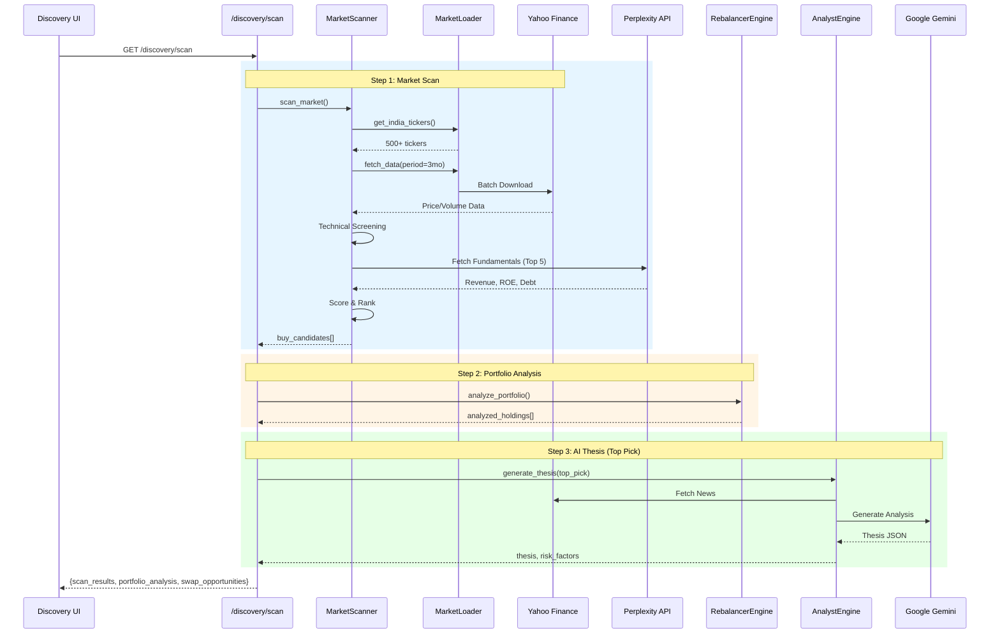

# Discovery Module - Backend Architecture

The Discovery module is the quantitative stock screening engine of AlphaSeeker. It identifies high-potential buy opportunities and portfolio rebalancing suggestions using a **multi-stage filtering pipeline**.

---

## Architecture Diagram



---

## Key Components

### 1. API Endpoint: `/discovery/scan`
**File:** [routes.py](file:///c:/Users/chabh/Documents/AlphaSeeker/backend/app/api/routes.py#L221-L294)

The main entry point that orchestrates the entire discovery flow:

| Step | Action | Engine Used |
|------|--------|-------------|
| 1 | Scan market for buy candidates | `MarketScanner` |
| 2 | Fetch user portfolio | `PortfolioEngine` |
| 3 | Analyze portfolio for rebalancing | `RebalancerEngine` |
| 4 | Generate AI thesis for top pick | `AnalystEngine` |
| 5 | Create swap recommendations | Route logic |

---

### 2. MarketScanner (Core Scanner Engine)
**File:** [scanner_engine.py](file:///c:/Users/chabh/Documents/AlphaSeeker/backend/app/engines/scanner_engine.py)

The **heart of the Discovery module** - a 6-stage quantitative screening pipeline:



#### Stage 3: Technical Screening Criteria

| Filter | Condition | Purpose |
|--------|-----------|---------|
| **Liquidity** | Daily Turnover > $1M | Ensure tradeable stocks |
| **Volatility** | 3% < Monthly Vol < 8% | Goldilocks zone |
| **Momentum SMA** | Price > SMA-50 AND SMA-20 | Uptrend confirmation |
| **RSI** | 50 ≤ RSI ≤ 70 | Healthy momentum, not overbought |
| **Volume Shock** | Current Vol > 1.5× Avg Vol | Institutional interest |
| **MACD** | Histogram > 0 | Bullish crossover |

#### Stage 5: Fundamental Checks (via Perplexity)

| Metric | Threshold | Rationale |
|--------|-----------|-----------|
| Revenue Growth | ≥ 15% YoY | Growth stock criteria |
| Return on Equity | ≥ 18% | Profitability threshold |
| Debt/Equity | < 100% | Financial stability |

#### Stage 6: Scoring Algorithm

```
Total Score = (Fundamental × 0.4) + (Momentum × 0.3) + (Valuation × 0.3)

Where:
- Fundamental Score = (Revenue Growth × 0.5) + (ROE × 0.5)
- Momentum Score = (RSI × 0.7) + (MACD Signal × 0.3)
- Valuation Score = Upside % to Target Price
```

---

### 3. MarketLoader (Data Provider)
**File:** [market_loader.py](file:///c:/Users/chabh/Documents/AlphaSeeker/backend/app/engines/market_loader.py)

Manages the stock universe and batch data fetching:

| Region | Universe |
|--------|----------|
| **India** | NIFTY 500 + ETFs (GOLDBEES, SILVERBEES, etc.) |
| **US** | Top 40 stocks + ETFs (SPY, QQQ, GLD, etc.) |

Uses `yfinance.download()` with threading for parallel data fetch.

---

### 4. RebalancerEngine (Portfolio Analysis)
**File:** [rebalancer_engine.py](file:///c:/Users/chabh/Documents/AlphaSeeker/backend/app/engines/rebalancer_engine.py)

Analyzes existing portfolio to identify weak positions:
- Calculates P&L % for each holding
- Identifies trend direction (UP/DOWN)
- Flags `SELL_CANDIDATE` for broken trend stocks

---

### 5. AnalystEngine (AI Thesis Generator)
**File:** [analyst_engine.py](file:///c:/Users/chabh/Documents/AlphaSeeker/backend/app/engines/analyst_engine.py)

Generates AI-powered investment thesis using **Google Gemini**:
- Fetches market data and news via yfinance
- Uses tiered model fallback strategy
- Returns: Recommendation, Thesis points, Risk factors, Confidence score

---

## Data Flow Summary



---

## Caching Strategy

The `MarketScanner` implements a **15-minute cache** to prevent API overload:

```python
CACHE_DURATION = 900  # 15 minutes

if self.cache and (time.time() - self.last_scan_time < CACHE_DURATION):
    return self.cache  # Return cached results
```

---

## Response Structure

```json
{
  "scan_results": [
    {
      "ticker": "TATASTEEL.NS",
      "price": 142.50,
      "score": 87.5,
      "upside_potential": 18.2,
      "momentum_score": 92.0,
      "rsi": 62.3,
      "vol_shock": 2.1,
      "sector": "Metals & Mining",
      "beta": 1.4,
      "thesis": ["Strong Q3 earnings...", "..."],
      "risk_factors": ["Global steel prices...", "..."],
      "recommendation": "BUY",
      "confidence": 78
    }
  ],
  "portfolio_analysis": [...],
  "swap_opportunities": [
    {
      "priority": 1,
      "sell": "WEAK_STOCK",
      "buy": "TATASTEEL.NS",
      "reason": "Sell weak stock to buy stronger momentum play"
    }
  ]
}
```

---

## Key Files Summary

| File | Purpose |
|------|---------|
| [routes.py](file:///c:/Users/chabh/Documents/AlphaSeeker/backend/app/api/routes.py) | API endpoint `/discovery/scan` |
| [scanner_engine.py](file:///c:/Users/chabh/Documents/AlphaSeeker/backend/app/engines/scanner_engine.py) | Core 6-stage scanning pipeline |
| [market_loader.py](file:///c:/Users/chabh/Documents/AlphaSeeker/backend/app/engines/market_loader.py) | Stock universe & data fetching |
| [analyst_engine.py](file:///c:/Users/chabh/Documents/AlphaSeeker/backend/app/engines/analyst_engine.py) | AI thesis generation (Gemini) |
| [rebalancer_engine.py](file:///c:/Users/chabh/Documents/AlphaSeeker/backend/app/engines/rebalancer_engine.py) | Portfolio rebalancing logic |
| [tickers.py](file:///c:/Users/chabh/Documents/AlphaSeeker/backend/app/utils/tickers.py) | NIFTY 500 ticker list |
