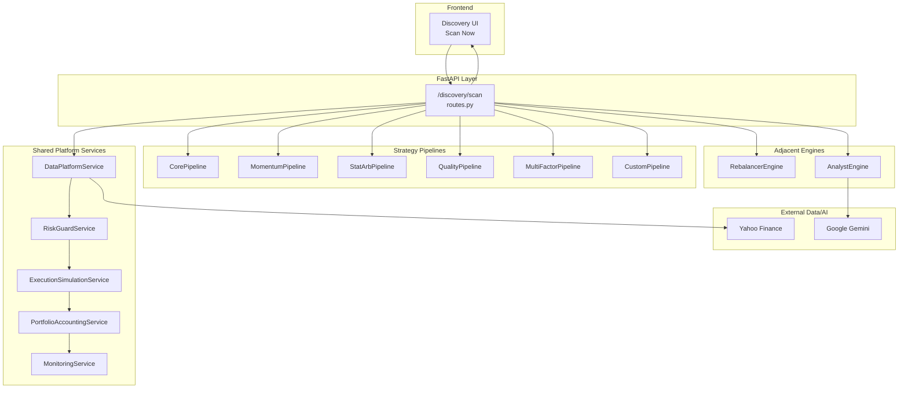
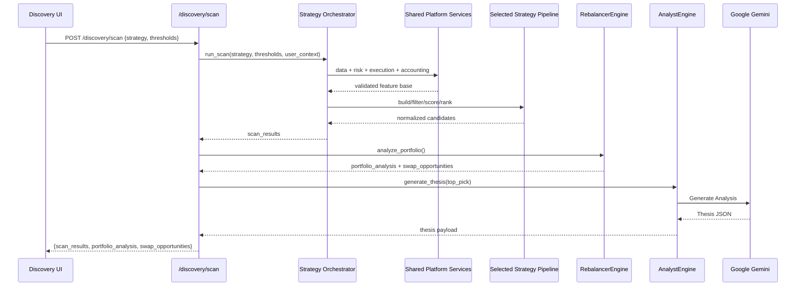

# Discovery Module - Backend Architecture

The Discovery module is the quantitative stock screening engine of AlphaSeeker. It identifies high-potential buy opportunities and portfolio rebalancing suggestions using a **hybrid architecture**:
- shared platform services (data, risk, execution simulation, accounting, monitoring)
- strategy-specific alpha pipelines (features, filters, scoring, ranking)

---

## Architecture Diagram



---

## Key Components

### 1. API Endpoint: `/discovery/scan`
**File:** `backend/app/api/routes.py`

The route orchestrates:
1. strategy selection + entitlement checks
2. shared platform service calls
3. selected strategy pipeline execution
4. portfolio rebalance enrichment
5. optional top-pick thesis generation

---

### 2. Strategy Orchestrator (Core Scanner Engine)
**File:** `backend/app/engines/scanner_engine.py`

`MarketScanner` serves as orchestration layer:
- resolve strategy id and parameters
- run shared platform gates
- invoke strategy-specific alpha pipeline
- normalize output to common response contract

#### Shared Platform Responsibilities

| Layer | Responsibility |
|-------|----------------|
| Data Platform | Universe + OHLCV/fundamentals ingestion and cache |
| Risk Guard | Hard safety and tradability checks |
| Execution Simulation | Slippage and executable-liquidity adjustments |
| Portfolio Accounting | PnL/exposure-aware enrichment for replacement logic |
| Monitoring | Scan telemetry, rejection metrics, drift and latency |

#### Strategy-Owned Responsibilities

| Strategy | Primary Alpha Behavior |
|----------|------------------------|
| Alphaseeker Core | Balanced baseline momentum + quality |
| Citadel Momentum | Continuation momentum with volume confirmation |
| Jane Street Statistical | Mean-reversion/statistical dislocation logic |
| Millennium Quality | Quality/profitability stability focus |
| DE Shaw Multi-Factor | Multi-factor blend (momentum + quality + valuation) |
| Custom Thresholds | User-defined tuning path |

All strategies must emit normalized `score` (0–100), rationale metadata, and risk flags.

---

### 3. MarketLoader (Data Provider)
**File:** [market_loader.py](file:///c:/Users/chabh/Documents/AlphaSeeker/backend/app/engines/market_loader.py)

Manages the stock universe and batch data fetching:

| Region | Universe |
|--------|----------|
| **India** | NIFTY 500 + ETFs (GOLDBEES, SILVERBEES, etc.) |
| **US** | Top 40 stocks + ETFs (SPY, QQQ, GLD, etc.) |

Uses `yfinance.download()` with threading for parallel data fetch.

---

### 4. RebalancerEngine (Portfolio Analysis)
**File:** [rebalancer_engine.py](file:///c:/Users/chabh/Documents/AlphaSeeker/backend/app/engines/rebalancer_engine.py)

Analyzes existing portfolio to identify weak positions:
- Calculates P&L % for each holding
- Identifies trend direction (UP/DOWN)
- Flags `SELL_CANDIDATE` for broken trend stocks

---

### 5. AnalystEngine (AI Thesis Generator)
**File:** [analyst_engine.py](file:///c:/Users/chabh/Documents/AlphaSeeker/backend/app/engines/analyst_engine.py)

Generates AI-powered investment thesis using **Google Gemini**:
- Fetches market data and news via yfinance
- Uses tiered model fallback strategy
- Returns: Recommendation, Thesis points, Risk factors, Confidence score

---

## Data Flow Summary



---

## Caching Strategy

The `MarketScanner` implements a **15-minute cache** to prevent API overload:

```python
CACHE_DURATION = 900  # 15 minutes

if self.cache and (time.time() - self.last_scan_time < CACHE_DURATION):
    return self.cache  # Return cached results
```

---

## Response Structure

```json
{
  "scan_results": [
    {
      "ticker": "TATASTEEL.NS",
      "price": 142.50,
      "score": 87.5,
      "upside_potential": 18.2,
      "momentum_score": 92.0,
      "rsi": 62.3,
      "vol_shock": 2.1,
      "sector": "Metals & Mining",
      "beta": 1.4,
      "thesis": ["Strong Q3 earnings...", "..."],
      "risk_factors": ["Global steel prices...", "..."],
      "recommendation": "BUY",
      "confidence": 78
    }
  ],
  "portfolio_analysis": [...],
  "swap_opportunities": [
    {
      "priority": 1,
      "sell": "WEAK_STOCK",
      "buy": "TATASTEEL.NS",
      "reason": "Sell weak stock to buy stronger momentum play"
    }
  ]
}
```

---

## Key Files Summary

| File | Purpose |
|------|---------|
| [routes.py](file:///c:/Users/chabh/Documents/AlphaSeeker/backend/app/api/routes.py) | API endpoint `/discovery/scan` |
| [scanner_engine.py](file:///c:/Users/chabh/Documents/AlphaSeeker/backend/app/engines/scanner_engine.py) | Hybrid strategy orchestration + shared platform integration |
| [market_loader.py](file:///c:/Users/chabh/Documents/AlphaSeeker/backend/app/engines/market_loader.py) | Stock universe & data fetching |
| [analyst_engine.py](file:///c:/Users/chabh/Documents/AlphaSeeker/backend/app/engines/analyst_engine.py) | AI thesis generation (Gemini) |
| [rebalancer_engine.py](file:///c:/Users/chabh/Documents/AlphaSeeker/backend/app/engines/rebalancer_engine.py) | Portfolio rebalancing logic |
| [tickers.py](file:///c:/Users/chabh/Documents/AlphaSeeker/backend/app/utils/tickers.py) | NIFTY 500 ticker list |
